Rumkin Data Pack
================

This is a data pack for Minecraft. To install it, download [this zip file](https://github.com/fidian/rumkin-data-pack/archive/master.zip). Do not extract the zip file. Open up your Minecraft world folder and place the zip file inside the `datapacks` folder.

The Armor Stand Statues requires a command block to give players books. For that command block to run, the `server.properties` file on the Minecraft server needs to have this line:

    enable-command-block=true

In-Game Changes
---------------

* Endermen do not pick up any blocks.
* All recipes are granted to the player.
* When someone is sleeping and others on the same server are not sleeping, the night passes significantly quicker.
* When anyone is sleeping, the weather will change to clear for a random time, roughly from 1 to 7 days of clear skies.
* Tool durability is shown in the action bar.
* Players AFK for 3+ minutes show up as gray in the list of players.
* Show player health in the list of players. This may not show up right away, but will kick in as soon as each player gets hurt or heals.
* Included the Armour Stand Statues datapack. See the special section below.

Recipes
-------

* You can smelt or use a blast furnace to get an iron ingot from a heavy weighted pressure plate, iron door, iron horse armor, and an iron trapdoor.

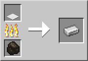
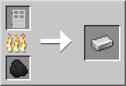
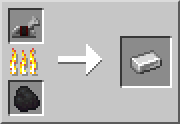
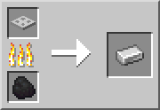

* You can smelt or use a blast furnace to get an iron nugget from a bucket, iron bars, shears, and a tripwire hook.

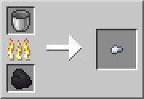
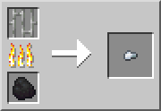
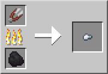
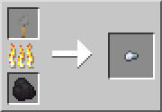

* Shortcut recipes are added, which use the same amount of materials but save you a crafting step. When logs are used, any type of log may be used in the recipe.

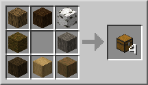
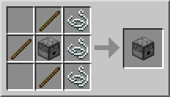
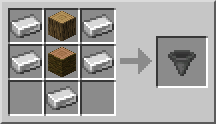
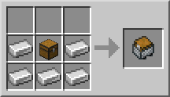
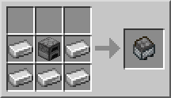
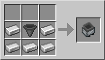
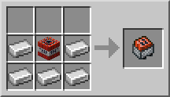
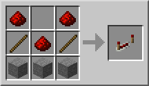
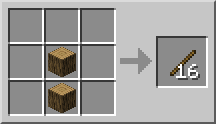

Armour Stand Statues
--------------------

An op can execute the command `/function fidian:as_setup` to place a command block in a bedrock box below the player with a button on a block above. Pressing the button enables the system for the nearest player and gives them a book.

Each player must have the system enabled for them individually. Simply getting the book from someone else will not work.

Use the book within three blocks of an armor stand. It has clickable links to allow armor stands to be posed, show/hide arms, and many other settings. The last page has moderator-only commands and requires the player to be in creative mode.

Further Optimizations
---------------------

* Most things are updated only once per second instead of happening with every tick.
* The code was rewritten to be as minimal as possible.

Changelog
---------

1.1.0 - 2019-10-27

* Added AFK detection.
* Added health in player list.
* Added armor stand statues.
* Added shortcut recipes.

1.0.0 - 2019-10-24

* Initial release.

Sources and Original Ideas
--------------------------

Please note that most of these were analyzed and recoded instead of copied. Some of these data packs are listed because they provided the idea and I wrote my own implementation. Others, especially the ones that dealt exclusively with recipes, were mostly copied verbatim with minor adjustments.

* [AFK Display](https://vanillatweaks.net/)
* [Anti-Enderman Grief by Awhikax](https://www.planetminecraft.com/mod/awhipacks-anti-enderman-grief/)
* [Armour Stand Statues by Phssthpok](https://www.planetminecraft.com/mod/armourstatuesv2-1-datapack/)
* [Common Iron Recycling by LemilasTheElf](https://www.planetminecraft.com/mod/common-iron-item-recycling/)
* [Death Coordinates by fancytweaks](http://www.9minecraft.net/death-coordinates-data-pack/)
* [Multiplayer Sleep by TheDiamondPlayables](https://www.planetminecraft.com/mod/multiplayer-sleep-datapack-sleeping-in-multiplayer/)
* [Show Tool Durability by pixel glasses](https://www.planetminecraft.com/mod/show-tool-durability/) - Copied in the durability table.
* [Vanilla Plus by Ligands](https://www.reddit.com/r/Minecraft/comments/91s3uc/a_handful_of_vanilla_custom_recipes_for_113_data/)
* [Wiki Datapack by PigletTubeYT](https://www.planetminecraft.com/mod/wiki-datapack/)
